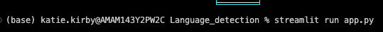
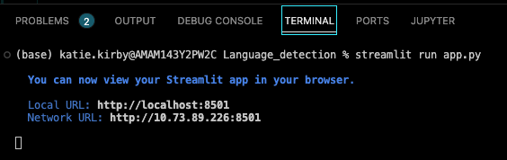
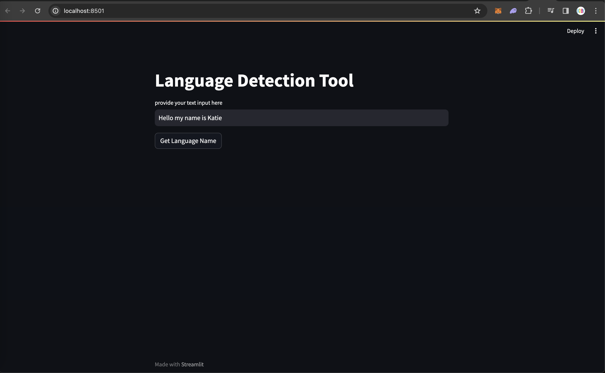
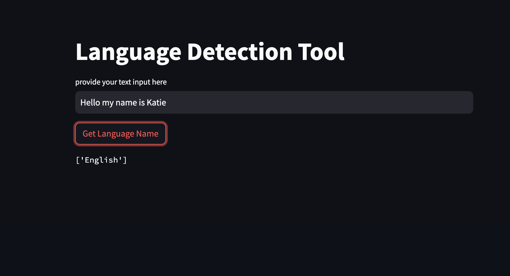
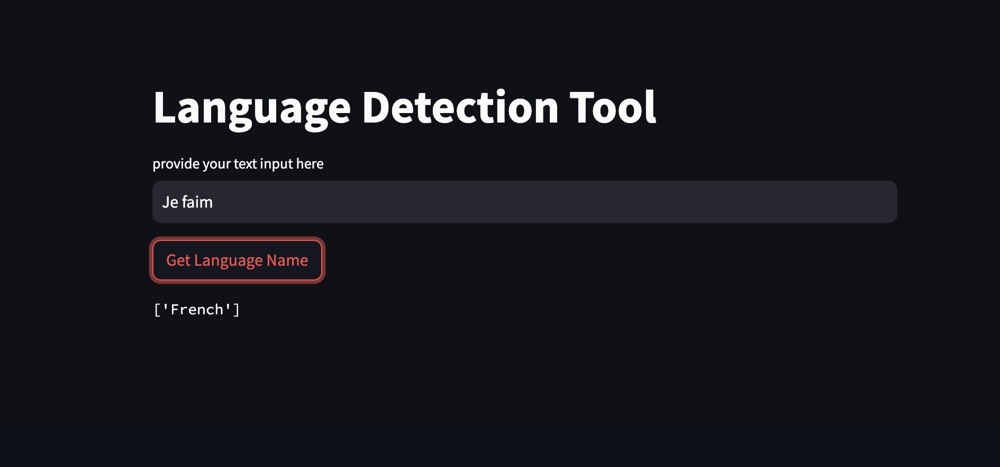
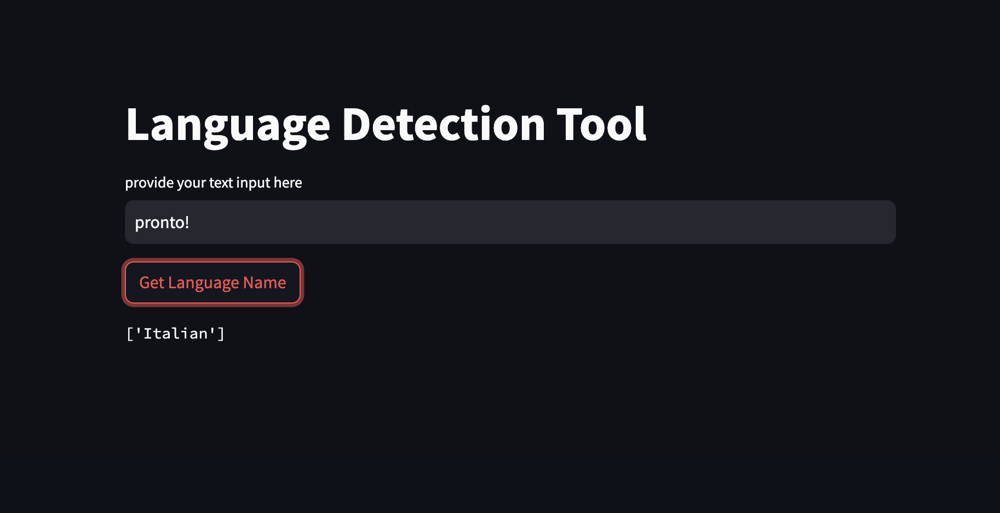

# Language Detection Web App
 
  

First, clone the repo at: https://github.com/Cryptolyfe/Language-Detection.git

 
 
  

- Before you run the below command make sure you have Streamlit installed.

 
  

***To install Streamlit from your terminal***

 

***Run 'pip install streamlit' ***
 
  
 
 

- After you confirm the installation completed without error you can run the following command:

 
  

  

- This will launch a local deloyment of the language detetction app...

 
 

 

...And the UI will launch in your browser!

 
  

 
  

- Insert preffered language text into the user input window and click "Get Language Name"

  

- Repeat this with as many languages as you wish!

 

 

- Or with as many languages as you know!

*you might need to update your requirements.txt file to run as packages are contantly being upgraded

